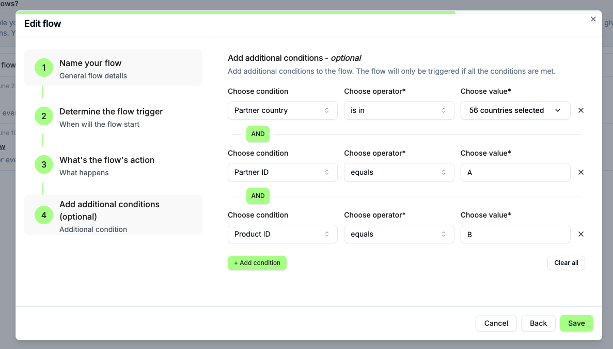

# 🧩 Tolt Flow Conditions Task

Welcome to the **Tolt Engineering Challenge**.

This task is designed to evaluate your ability to work with **React (Next.js)**, **TypeScript**, and **UI state management** using **shadcn/ui**.  
You’ll be working on a simplified version of the **Flow Conditions** modal used in Tolt’s production app.

---

## 🎯 Goal

You are given a working version of the **“Add Additional Conditions”** modal.  
Your task is to **extend the existing logic** so that conditions can be grouped and nested using **AND / OR** operators.

In production, this feature determines whether a commission should be generated based on certain criteria (like partner, product, billing type, etc.).

---

## 📦 What’s already included

The project includes:

- ✅ **Functional base modal** built with `shadcn/ui`
- ✅ Flat conditions logic (all AND or all OR)
- ✅ A working “Test Flow” button that evaluates mock data against the entered conditions
- ✅ UI components for adding, removing, and clearing conditions
- ✅ Predefined condition options:
  - `partner_id`
  - `product_id`
  - `interval`
  - `billing_type`

Your starting UI should look like this:



---

## 🧠 Your task

You need to **implement nested condition groups**, allowing structures like:

```text
(Partner ID equals "p_123")
AND
(
  (Billing Type equals "recurring")
  OR
  (Interval equals "monthly")
)
```

## 📝 Notes

The flow object looks like this:

```json
 {
    "id": "flw_UvLodqUdCF8Y1KuSZuiW9mCY",
    "name": "$5 Flow",
    "description": "Earn $5 for every referral.",
    "event": "transaction_created",
    "action_type": "generate_commission",
    "action": {
        "type": "fixed",
        "value": 5
    },
    "conditions": [
        {
            "id": "98209e0a-8b2e-4898-bd97-e075cbff2429",
            "type": "partner_country",
            "value": [
                "AF",
                "AX",
                "AL",
                "DZ",
                "AS",
                "AD",
                "AO",
                ],
            "operator": "is in",
            "logicalOperator": "AND"
        }
    ],
    "organization_id": "org_9MTRHhGnf3Emjf3My7d87ucM",
    "program_id": "prg_udJZjmJJrnnJrW5auom7NBJv",
    "group_id": "grp_fXhgGMXzJedeA9BmRLkgp9tq",
    "created_at": "2025-06-23T03:21:15.814Z",
    "updated_at": "2025-06-23T05:40:11.636Z",
    "active": true,
    "partner_overrides": [],
    "options": {
        "auto_approval": {
            "type": "manual",
            "delay_days": 0
        },
        "prorate_yearly_subscription": {
            "period": "none",
            "enabled": false
            }
        },
        "group_name": "Default"
    },
```

## Current Problem

There is a user that wants to give a $10 commission for every tranasction where the partner is in XYZ countries and the product ID is either X or Y.

```text
Partner Country is in ["AF", "AX", "AL", "DZ", "AS", "AD", "AO"]
AND
(
  Product ID is X
  OR
  Product ID is Y
)
```

## When you are done

1. Push changes to your repository or submit a pull request.
2. Send the link to the repository or PR if possible send the link to the live demo.
3. Record a video explaining your solution and how it works and answer the following questions:
   - This data is coming from the database, does the solution require changes to the database schema?
     - A. If so, how would you change the schema?
     - B. What will happen to the existing flows, will they still work with your code?
     - C. Will we need to update all existing flows, or do you have a different approach for it?
   - Would you do it differently if you had to do it again - design wise, code wise, etc...?
  

## Desig
- If the design is not great and you can do better, then feel free to do it :) 
